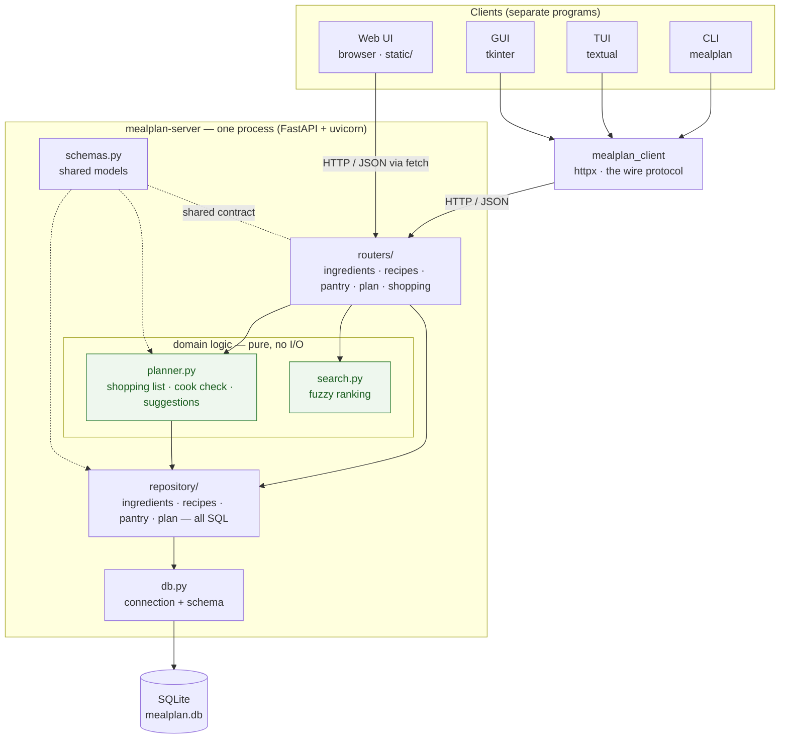
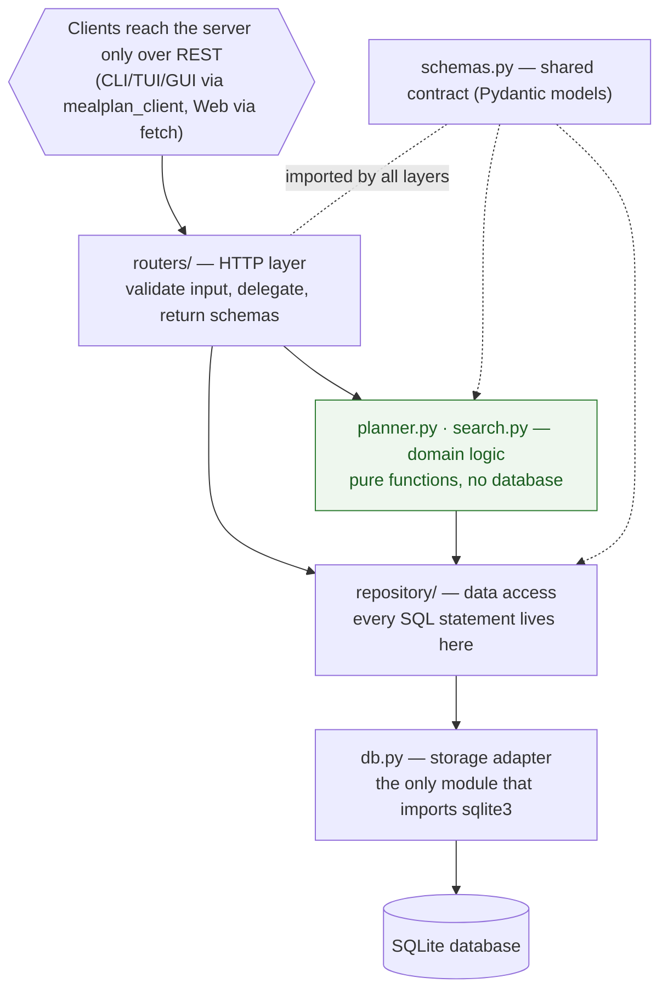
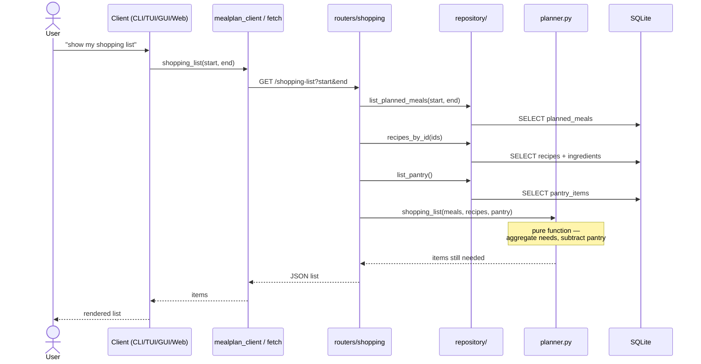
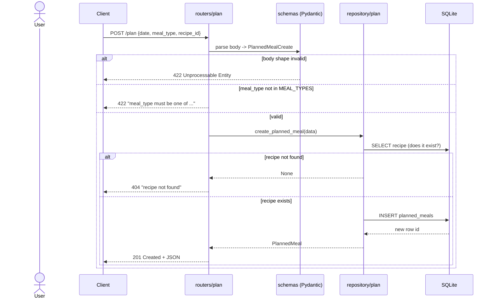
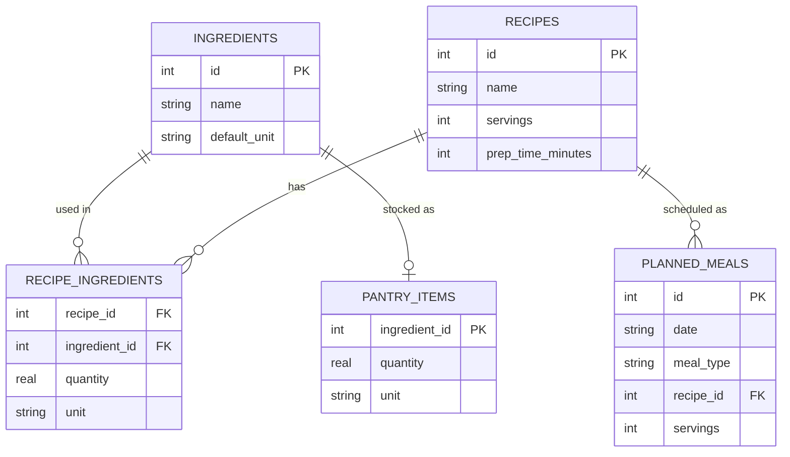
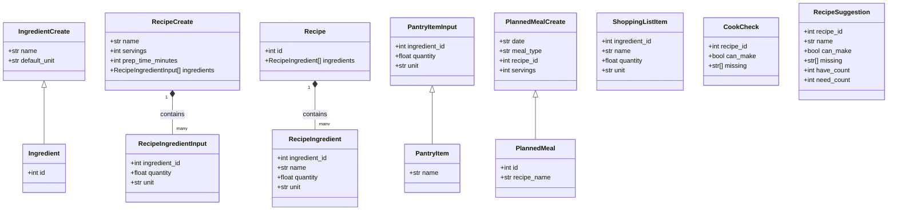

# Architecture

A client–server application. A single FastAPI server process owns an SQLite database and
exposes a REST API. Three Python clients (CLI, TUI, GUI) talk to it through one shared
client library; a fourth client — a browser web UI — is static files served by the server
that call the same REST API directly with `fetch`. No client ever touches the database.

> The diagrams below are rendered inline (GitHub renders ```mermaid``` blocks). The
> matching source files live in [`docs/diagrams/`](diagrams/) — `components.mmd`,
> `layers.mmd`, `request_flow.mmd`, and `schema.mmd` — for editing or re-rendering.

## Component view

Who talks to whom. Four clients, one server process, one database. Green = pure logic
(no I/O). Source: [`diagrams/components.mmd`](diagrams/components.mmd).



## Layered dependency view

The same server, seen as layers. **Every arrow points downward — a lower layer never
imports a higher one.** That single rule is what keeps the domain logic testable without a
database and the storage swappable. Source: [`diagrams/layers.mmd`](diagrams/layers.mmd).



### Modules at a glance

| Module | Responsibility | Depends on |
|---|---|---|
| `db.py` | connection + schema (only module importing `sqlite3`) | sqlite3 |
| `repository/` | CRUD, all SQL — one module per entity | db, schemas |
| `planner.py` | shopping list, cook check, pantry suggestions — pure logic | schemas |
| `search.py` | fuzzy recipe-name scoring & ranking — pure logic | schemas |
| `schemas.py` | wire/data models (Pydantic) | — |
| `deps.py` | shared FastAPI dependency (per-request connection) | db |
| `routers/` | HTTP routes, one module per resource | repository, planner, search, schemas, deps |
| `api.py` | app assembly: include routers + serve web client | routers, db |
| `main.py` | uvicorn entry point | api |

Both the route layer and the data layer are **split per resource**: `routers/` has one
`APIRouter` module per resource, and `repository/` has one SQL module per entity (with
`__init__.py` re-exporting so callers still write `repository.create_recipe(...)`). Both
were refactored out of single monolithic modules — see [`refactoring.md`](refactoring.md)
and the git history. Adding a resource is a new router module plus a new repository module.

### Modules in detail

**`db.py`** — the storage adapter. Holds the `CREATE TABLE` schema and two functions:
`connect(db_path)` (returns a `sqlite3.Connection` with `row_factory` set and foreign
keys enabled) and `init_db(conn)` (runs the schema, idempotently). It is the *only* module
that imports `sqlite3`; swap this one file to change databases.

**`repository/`** — data access, one module per entity. Every function takes a
`Connection` and returns `schemas` objects, never raw rows:
- `ingredients.py` — `create/list/get_ingredient`
- `recipes.py` — `create/get/list/delete_recipe`, `recipes_by_id`, and the private
  `_recipe_ingredients` join helper
- `pantry.py` — `set_pantry_item` (an upsert), `list_pantry`, `remove_pantry_item`
- `plan.py` — `create_planned_meal` (validates the recipe via `recipes.get_recipe`),
  `list_planned_meals` (optional date range), `delete_planned_meal`
- `__init__.py` re-exports all of the above, so callers write `repository.create_recipe(...)`.

**`planner.py`** — derived data, pure functions over `schemas`:
- `required_ingredients` — totals each ingredient across planned meals, scaled by servings
- `shopping_list` — required minus pantry stock
- `missing_for_recipe` / `can_make` — the cook check
- `suggest_recipes` — ranks recipes by pantry coverage
- `_canonical(quantity, unit)` — the **unit seam**: currently identity; the single place to
  add g↔kg / ml↔l conversions later (every aggregation routes through it).

**`search.py`** — pure fuzzy matching: `fuzzy_score(query, text)` (exact > prefix >
substring > subsequence, with a compactness bonus) and `rank_recipes`.

**`routers/`** — one `APIRouter` per resource. Handlers are thin: parse the request into a
`schemas` model, call `repository`/`planner`/`search`, return a `schemas` model. They map
domain conditions to HTTP status codes (see *Write path & error handling* below).

**`deps.py`** — `get_conn`, the per-request connection dependency injected into every route.

**`schemas.py`** — the Pydantic models shared by the API and clients (see *Data contract*).

**`api.py` / `main.py`** — `create_app(db_path)` initialises the DB and includes the
routers + static web client; `main.py` runs it under uvicorn.

## Request flow

A representative request — the derived shopping list — showing routes delegating reads to
the repository and computation to the pure planner. Source:
[`diagrams/request_flow.mmd`](diagrams/request_flow.mmd).



## Write path & error handling

Reads are simple; writes validate in stages, and each stage owns a specific failure
response. The `POST /plan` path below is representative. Source:
[`diagrams/write_flow.mmd`](diagrams/write_flow.mmd).



**Status-code conventions** (asserted by the contract tests):

| Status | When | Raised by |
|---|---|---|
| `200` | successful read / `PUT /pantry` | route returns a model |
| `201` | resource created (`POST /ingredients`, `/recipes`, `/plan`) | route `status_code=201` |
| `204` | successful delete | route `status_code=204` |
| `404` | referenced resource missing (recipe, ingredient, pantry item, meal) | route, after repository returns `None`/`False` |
| `409` | duplicate ingredient name | route, catching `sqlite3.IntegrityError` |
| `422` | bad body shape (Pydantic) **or** invalid `meal_type` vocabulary | Pydantic / route |

The pattern: **Pydantic** guards the request *shape*, the **router** enforces *domain
rules* and translates results into status codes, and the **repository** signals
missing/duplicate data through return values and DB constraints — no HTTP concepts leak
below the router.

## Data model

Five tables; `recipe_ingredients` is the many-to-many join between recipes and
ingredients. Source: [`diagrams/schema.mmd`](diagrams/schema.mmd).



### Data contract (schemas)

The Pydantic models in `schemas.py` are shared by the API and every client. Input models
(`…Create` / `…Input`) carry only what a caller supplies; read models add server-assigned
fields (ids, joined names); derived models (`ShoppingListItem`, `CookCheck`,
`RecipeSuggestion`) are computed, never stored. Source:
[`diagrams/data_contract.mmd`](diagrams/data_contract.mmd).



## REST API surface

| Method & path | Purpose |
|---|---|
| `GET/POST /ingredients` | list / create ingredients |
| `GET/POST /recipes`, `GET/DELETE /recipes/{id}` | manage recipes (`?q=` filters by name) |
| `GET /recipes/search?q=` | fuzzy-ranked recipe search (`search.py`) |
| `GET /recipes/suggestions` | recipes ranked by pantry coverage (`planner.suggest_recipes`) |
| `GET /recipes/{id}/can-make` | cook check against the pantry |
| `GET /pantry`, `PUT /pantry`, `DELETE /pantry/{ingredient_id}` | pantry stock |
| `GET/POST /plan`, `DELETE /plan/{id}` | weekly meal plan (`?start=&end=`) |
| `GET /shopping-list` | derived list for a date range (`?start=&end=`) |

## Process & runtime notes

- **One server process.** `main.py` runs `uvicorn.run(create_app(db_path))` — a single
  process listening on one host/port (default `127.0.0.1:8000`, overridable via
  `$MEALPLAN_HOST` / `$MEALPLAN_PORT`).
- **Connection per request.** The `get_conn` dependency opens a short-lived SQLite
  connection at the start of each request and closes it in a `finally` after the response.
  No pooling and no long-lived handle — simple and correct at this scale.
- **Concurrency model.** Routes are sync `def`, so FastAPI runs each in a thread from its
  worker pool; because every request gets its *own* connection, there's no shared mutable
  state between requests. SQLite serialises writes (one writer at a time), which is fine for
  a single-user tool; reads are concurrent.
- **Startup.** `create_app()` calls `init_db()` once, so the schema exists before the first
  request; the static web client is mounted only if `static/` is present.
- **Configurable database.** `$MEALPLAN_DB` (default `mealplan.db`); `migrations/seed.py`
  loads demo data. The `.db` file is gitignored — only the schema (`db.py`) and seed script
  are versioned, so each environment builds its own database.
- **Clients are decoupled by the URL.** Every client targets `$MEALPLAN_URL` (Python
  clients) or same-origin (web), so the same code points at a local or remote server
  unchanged.

## Cross-references

- [`design.md`](design.md) — *why* these choices were made, and what was deliberately left out.
- [`testing.md`](testing.md) — how the unit / contract / integration layers map onto this architecture.
- [`refactoring.md`](refactoring.md) — the two refactors that produced the `routers/` and `repository/` splits.
- [`requirements.md`](requirements.md) — the functional and non-functional requirements this design satisfies.
