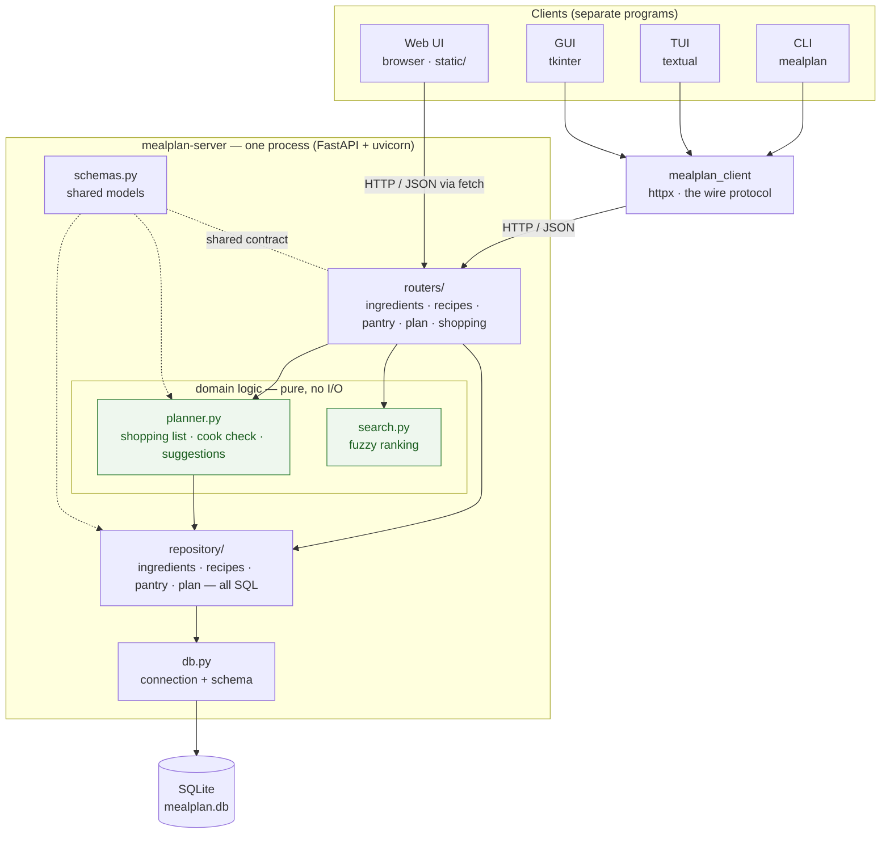
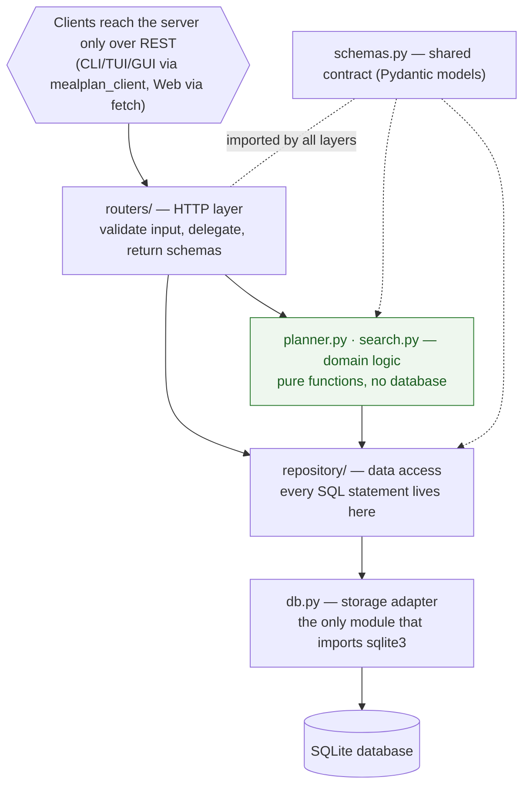
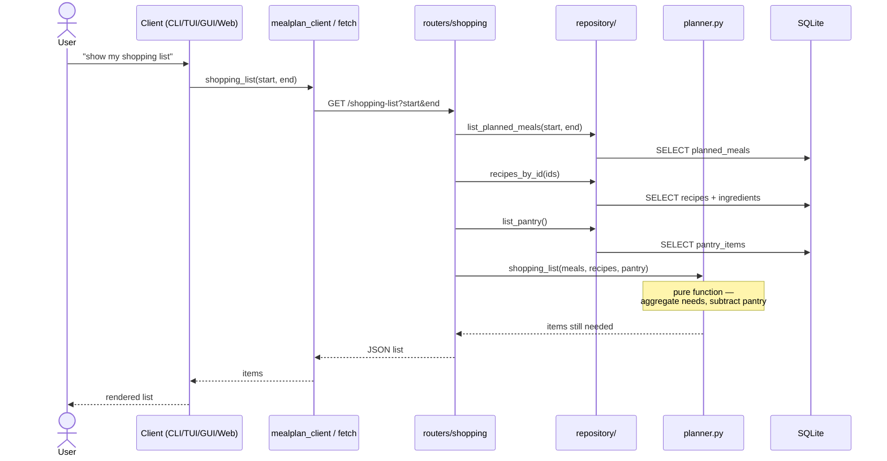
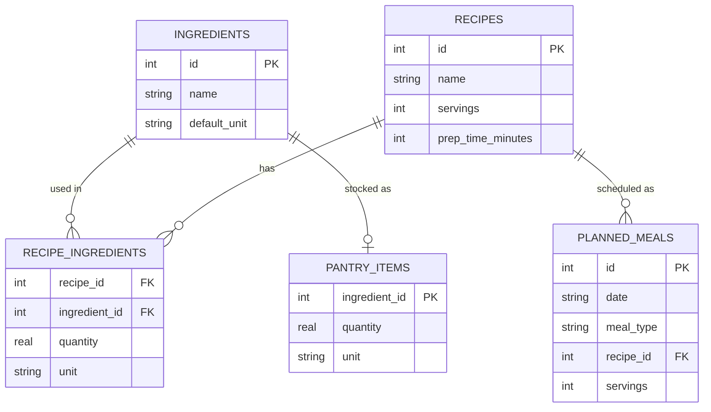

# Architecture

A client–server application. A single FastAPI server process owns an SQLite database and
exposes a REST API. Three Python clients (CLI, TUI, GUI) talk to it through one shared
client library; a fourth client — a browser web UI — is static files served by the server
that call the same REST API directly with `fetch`. No client ever touches the database.

> The diagrams below are rendered inline (GitHub renders ```mermaid``` blocks). The
> matching source files live in [`docs/diagrams/`](diagrams/) — `components.mmd`,
> `layers.mmd`, `request_flow.mmd`, and `schema.mmd` — for editing or re-rendering.

## Component view

Who talks to whom. Four clients, one server process, one database. Green = pure logic
(no I/O). Source: [`diagrams/components.mmd`](diagrams/components.mmd).



## Layered dependency view

The same server, seen as layers. **Every arrow points downward — a lower layer never
imports a higher one.** That single rule is what keeps the domain logic testable without a
database and the storage swappable. Source: [`diagrams/layers.mmd`](diagrams/layers.mmd).



### Modules at a glance

| Module | Responsibility | Depends on |
|---|---|---|
| `db.py` | connection + schema (only module importing `sqlite3`) | sqlite3 |
| `repository/` | CRUD, all SQL — one module per entity | db, schemas |
| `planner.py` | shopping list, cook check, pantry suggestions — pure logic | schemas |
| `search.py` | fuzzy recipe-name scoring & ranking — pure logic | schemas |
| `schemas.py` | wire/data models (Pydantic) | — |
| `deps.py` | shared FastAPI dependency (per-request connection) | db |
| `routers/` | HTTP routes, one module per resource | repository, planner, search, schemas, deps |
| `api.py` | app assembly: include routers + serve web client | routers, db |
| `main.py` | uvicorn entry point | api |

Both the route layer and the data layer are **split per resource**: `routers/` has one
`APIRouter` module per resource, and `repository/` has one SQL module per entity (with
`__init__.py` re-exporting so callers still write `repository.create_recipe(...)`). Both
were refactored out of single monolithic modules — see [`refactoring.md`](refactoring.md)
and the git history. Adding a resource is a new router module plus a new repository module.

## Request flow

A representative request — the derived shopping list — showing routes delegating reads to
the repository and computation to the pure planner. Source:
[`diagrams/request_flow.mmd`](diagrams/request_flow.mmd).



## Data model

Five tables; `recipe_ingredients` is the many-to-many join between recipes and
ingredients. Source: [`diagrams/schema.mmd`](diagrams/schema.mmd).



## REST API surface

| Method & path | Purpose |
|---|---|
| `GET/POST /ingredients` | list / create ingredients |
| `GET/POST /recipes`, `GET/DELETE /recipes/{id}` | manage recipes (`?q=` filters by name) |
| `GET /recipes/search?q=` | fuzzy-ranked recipe search (`search.py`) |
| `GET /recipes/suggestions` | recipes ranked by pantry coverage (`planner.suggest_recipes`) |
| `GET /recipes/{id}/can-make` | cook check against the pantry |
| `GET /pantry`, `PUT /pantry`, `DELETE /pantry/{ingredient_id}` | pantry stock |
| `GET/POST /plan`, `DELETE /plan/{id}` | weekly meal plan (`?start=&end=`) |
| `GET /shopping-list` | derived list for a date range (`?start=&end=`) |

## Process & runtime notes

- **One server process.** `main.py` runs `uvicorn.run(create_app(db_path))` — a single
  process listening on one host/port (default `127.0.0.1:8000`).
- **Connection per request.** The `get_conn` dependency opens a short-lived SQLite
  connection for each request and closes it after — simple and thread-safe at this scale.
- **Configurable database.** `$MEALPLAN_DB` (default `mealplan.db`); the server creates the
  schema on startup, and `migrations/seed.py` loads demo data.

See [`design.md`](design.md) for the rationale behind these choices (and what was
deliberately left out), and [`testing.md`](testing.md) for how the layers are tested.
