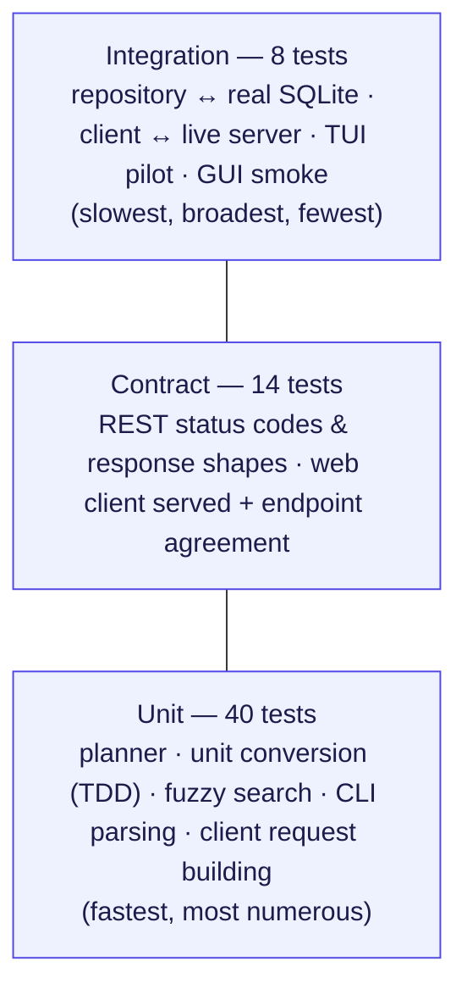

# Test plan

How `mealplan` is tested, and why it's tested this way. The suite has **62 tests** across
three levels and covers every component — the server *and* all four clients.

## Objectives

1. **Get the derived logic right.** The planner (shopping list, cook check, suggestions,
   unit conversion) and the fuzzy search are the parts most likely to be subtly wrong, so
   they get the deepest, most exhaustive testing.
2. **Keep the API contract stable.** Clients depend on exact status codes and response
   shapes; those are pinned so a route change can't silently break a client.
3. **Prove the wiring works end to end.** The real client, TUI, and GUI are exercised
   against a real running server backed by real SQLite.
4. **Make refactoring safe.** Behavior-level tests act as a regression net — the two
   architecture refactors (see [`refactoring.md`](refactoring.md)) kept the suite green to
   prove behavior was preserved.
5. **Catch client/server drift.** The web UI is checked to call only endpoints that exist.

## Strategy

Test each component **at the cheapest level that's meaningful**, mirroring the architecture
layers ([`architecture.md`](architecture.md)):

- pure logic → **unit** tests with hand-built objects (no DB, no HTTP);
- the HTTP surface → **contract** tests through FastAPI's `TestClient`;
- cross-component wiring → **integration** tests against a real server and database.

Where logic is non-trivial and new, it's built **test-first** (TDD) — see below.

## The test pyramid

Many fast unit tests at the base, fewer broad integration tests at the top. Source:
[`diagrams/test_pyramid.mmd`](diagrams/test_pyramid.mmd).



## Coverage by component

| Component | Level | Test file |
|---|---|---|
| `planner.py` (shopping list, cook check, suggestions) | unit | `unit/test_planner.py` |
| `planner._canonical` (unit conversion, **TDD**) | unit | `unit/test_unit_conversion.py` |
| `search.py` (fuzzy scoring & ranking) | unit | `unit/test_search.py` |
| `cli/` (argument parsing) | unit | `unit/cli/test_argument_parsing.py` |
| `mealplan_client` (request building) | unit | `unit/client/test_client_requests.py` |
| `routers/` + REST contract | contract | `contract/test_api_contract.py` |
| web client (served files, valid JS, endpoint agreement) | contract | `contract/test_web_client.py` |
| `repository/` + `db.py` (real SQL) | integration | `integration/test_repository_with_real_db.py` |
| `mealplan_client` end to end | integration | `integration/test_client_against_server.py` |
| `tui/` (interactive behavior) | integration | `integration/test_tui_pilot.py` |
| `gui/` (interactive behavior) | integration | `integration/test_gui_smoke.py` |

## Levels in detail

### Unit (`tests/unit/` — 40 tests)

Pure functions and parsing, built by hand — fast, no I/O.

- **`test_planner.py`** — scaling by servings, aggregating an ingredient across meals,
  subtracting pantry stock, cross-unit partial cover, the cook check, suggestion ranking,
  output ordering.
- **`test_unit_conversion.py`** — mass/volume conversion in `_canonical` (see *TDD* below).
- **`test_search.py`** — the fuzzy scorer: exact/prefix/substring/subsequence tiers,
  ranking order, ties, and non-matches scoring zero.
- **`cli/test_argument_parsing.py`** — each subcommand maps to the right handler and
  coerces its arguments (ints, floats, the 3-value `plan --add`, errors on bad input).
- **`client/test_client_requests.py`** — `MealPlanClient` builds the right requests
  (method, URL, query params, JSON body), captured with httpx's `MockTransport`.

### Contract (`tests/contract/` — 14 tests)

The HTTP surface, through FastAPI's `TestClient`.

- **`test_api_contract.py`** — `201` on create; `404`/`409`/`422` on the error paths;
  joined ingredient names; exact shopping-list and suggestion shapes; and that
  `/recipes/search` isn't shadowed by `/recipes/{id}`.
- **`test_web_client.py`** — the files are served; `app.js` is valid JavaScript
  (`node --check`); and every endpoint the JS calls matches a real route (drift guard).

### Integration (`tests/integration/` — 8 tests)

Cross-component, against a real server/database.

- **`test_repository_with_real_db.py`** — repository against a temp SQLite file: joins, the
  pantry upsert, the foreign-key cascade on delete, date-range filtering.
- **`test_client_against_server.py`** — the real `MealPlanClient` driving the real app on a
  **live uvicorn server** (background thread, real socket), end to end.
- **`test_tui_pilot.py`** — the real `MealPlanTUI` via Textual's `run_test` pilot against a
  live seeded server: loads recipes, renders suggestions, fuzzy-searches.
- **`test_gui_smoke.py`** — the real tkinter GUI against a live server; **skips** when there
  is no display (headless CI).

## Test-driven development

The unit-conversion feature was built test-first to demonstrate the practice end to end:

1. `TDD (red)` commit — `test_unit_conversion.py` added with the implementation absent;
   6 of 8 assertions fail.
2. `TDD (green)` commit — `planner._canonical` implemented; the suite goes green.

Checking out the red commit shows failing tests; the green commit shows them passing with
no test edits. (See the git history for the two commits.)

## Fixtures (`tests/conftest.py`)

One fixture per level, so each test asks for exactly the layer it needs:

- `conn` — a real connection to a temp SQLite database
- `client` — FastAPI `TestClient` (in-process routing)
- `live_server` — the app under a real uvicorn server in a background thread; yields its URL
- `api_client` — a real `MealPlanClient` pointed at `live_server`

Most tests get an isolated temp database (`db_path` / `tmp_path`), so they neither share
state nor touch the developer's `mealplan.db`.

## Tooling & running

```bash
uv run pytest                 # everything (62 tests)
uv run pytest tests/unit      # just the fast logic/parsing tests
uv run pytest -q              # quiet
uv run pytest -k conversion   # a subset by keyword
```

Tools: **pytest** (runner), **httpx** `MockTransport` (client unit tests) and FastAPI
`TestClient` (contract), **uvicorn** in a thread (integration), Textual's `run_test`
(TUI), and **node** `--check` (web JS syntax). No network access is required.

## Out of scope (deliberate)

- **Browser DOM end-to-end** (clicking through the web UI, asserting rendered rows). The
  web tests verify the JS parses and targets real endpoints, not its rendering — a full
  Playwright suite is heavy and flaky for a project this size.
- **GUI pixel rendering.** The GUI test exercises data wiring, not appearance.
- **Performance / load / concurrency** testing — not a goal for a single-user local tool.
- **Authentication / authorization** — the app has none by design (see `design.md`).
